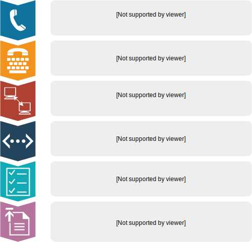

.. _overview:

Overview
========

What is the Outcome Measures Self Service System (OMSSS)?
---------------------------------------------------------

The Outcome Measures Self Service System (OMSSS) is an online service that
allows clients of psychological services to fill in an Outcome Measure,
such as the Kessler-5 (K5) and have the individual item scores automatically
reported back to a third party client management system. The OMSSS offers flexibility
in the way it's implemented, making it adaptable to the existing processes of each provider
organisation.

The OMSSS has been integrated into the Primary Mental Health Care Minimum Dataset
(PMHC MDS) or if used via an Application Programming Interface (API), it can
be integrated into a Healthcare Provider’s own CMS.  Providers are able to choose
whether the clients can complete the measure in their own homes before their
appointment, or on the provider's device at their clinic.

What does the Outcome Measures Self Service System (OMSSS) do?
--------------------------------------------------------------

The Outcome Measures Self Service System is accessed by clients of mental health
services and used to enter Outcome Measures, for example the Kessler-5 (K5).
Subscales and totals are automatically calculated and item scores and totals are uploaded
into the PMHC MDS or the provider's own CMS if this has been integrated with the OMSSS
using the API.  The information can also be provided in a report to the relevant psychologist.
This automation reduces the administrative workload of clinical staff and minimises the chance of
errors.

How does the Outcome Measures Self Service System (OMSSS) work?
---------------------------------------------------------------

The process of creating a new 'collection' using the practitioner's
Outcome Measure of choice is started by the user of the registration system when
taking the appointment (for example, a receptionist).  When they send a request
for a new 'collection', a link will be sent to the client via email or SMS to complete
the measure.  The client will then complete the measure using their own device at home
or in the waiting room prior to the appointment.  The completed questionnaire will then
automatically be uploaded into the CMS and optionally a report will be emailed to the
appropriate psychologist.  Here is an example outlining how the OMSSS might be integrated
into a client management system:

Features and benefits
---------------------

*  Flexibility for the OMSSS to be implemented in a way that suits the provider's ways of working and preferred approach
   to client completion of the measure
*  Flexibility for provider organisations to use the outcome measure of their choice, including those not
   part of the Primary Mental Health Care Minimum Dataset (PMHC MDS)
*  Flexibility regarding the treatment of completed questionaries.  Subscales can be uploaded to the PMHC MDS,
   the provider's own CMS (if integrated with the OMSSS using the API), and reports can be emailed directly
   to the relevant psychologist.
*  Significant reduction in data entry for staff
*  Automated scoring and integration with PMHC MDS / CMS reduces risk of data entry and scoring errors
*  An extensible system that can support Outcome Measures in addition to those specified in the PMHC MDS
*  An intuitive, accessible client interface that is supported on a range of devices
*  Greater insight provided into clients’ progress and the efficacy of treatments over a period of time
