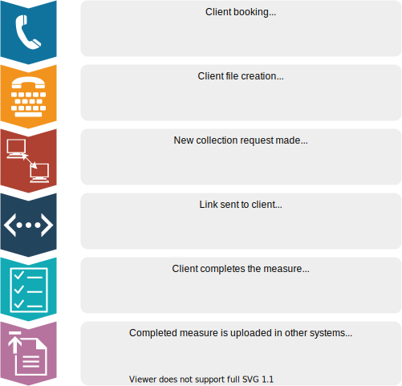
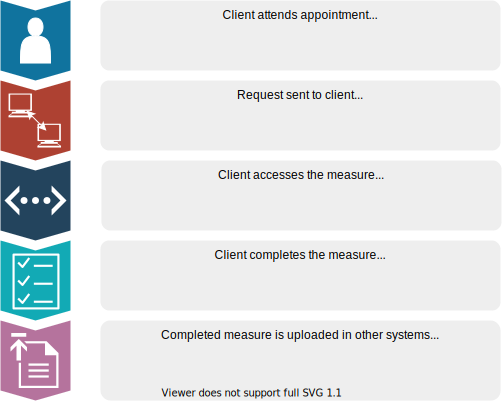

.. _overview:

TODO: AC to review

Overview
========

What is the Outcome Measures Self Service System (OMSSS)?
---------------------------------------------------------

The Outcome Measures Self Service System (OMSSS) is an online service funded by the
Australian Government Department of Health as part of the Primary Mental Healthcare
Minimum Data Set (PMHC MDS). It allows clients of mental health services commissioned
by Primary Health Networks (PHNs) to complete the standardised outcome measures
mandated in the PMHC MDS and have the results reported back to their service providers.
The OMSSS offers flexibility in the way it is implemented, making it more accessible
to service consumers who will be able to complete the information on their devices,
at a time that suits them, and will replace the current 'paper and pencil' systems
currently in place in many organisations. It is also adaptable to the existing processes
of each provider organisation, integrating with local third part client information
management systems (CIMS) via an application programming interface (API).

The OMSSS has been integrated into the PMHC MDS or if used via an API, it can
be integrated into a Healthcare Provider’s own CIMS.  Providers are able to choose
whether the clients can complete the measure in their own homes before or between
appointments, or on the provider's device at their service delivery centre.

What does it do?
----------------

The OMSSS is accessed by clients of PHN-commissioned mental health
services and used to enter Outcome Measures, for example the Kessler-10 (K10).
Subscales and totals are calculated automatically and item scores and totals are uploaded
into the PMHC MDS or the provider's own CIMS if this has been integrated with the OMSSS
using the API.  The information can also be provided in a report to the relevant service provider.
This automation reduces the administrative workload of clinical staff and minimises the chance of
errors.

How does it work?
-----------------

The OMSSS has been designed to be flexible and work within the differing processes of
many service providers. Below are a couple of examples of how OMSSS might integrated into
existing processes:

Example 1: Outcome measure sent to client to complete before their first appointment
~~~~~~~~~~~~~~~~~~~~~~~~~~~~~~~~~~~~~~~~~~~~~~~~~~~~~~~~~~~~~~~~~~~~~~~~~~~~~~~~~~~~

In this example, the process of creating a new 'collection' using the practitioner's
outcome measure of choice is started by the user of the registration system when
taking the appointment (for example, a receptionist).  When they send a request
for a new 'collection', a link will be sent to the client via email or SMS to complete
the measure. The client will then complete the measure using their own device at home
or in the waiting room prior to the appointment. The completed questionnaire will then
automatically be uploaded into the CIMS and optionally a report will be emailed to the
appropriate service provider. Please remember that data collection consent processes
still need to be built into this process. The service provider will either need to
obtain consent from the client before sending the link, or consent will initially
need to be recorded in the PMHC MDS as ‘No’ and changed to ‘Yes’ after consent
has been obtained. Here is a diagram outlining how the OMSSS might be integrated
into a client management system:

Example 2: Outcome measure completed by client at Provider’s service delivery centre
~~~~~~~~~~~~~~~~~~~~~~~~~~~~~~~~~~~~~~~~~~~~~~~~~~~~~~~~~~~~~~~~~~~~~~~~~~~~~~~~~~~~

In this example, the process of creating a new ‘collection’ using the
practitioner’s outcome measure of choice is started by the user of the
registration system (either a receptionist or a practitioner) when the client
attends the Provider’s service delivery centre for an appointment. When they
send a request for a new ‘collection’, a QR code is generated. A mobile device
such as a tablet can then be used to navigate to the link provided by the QR code.
The client can be given the tablet to fill out the measure in the waiting room
or during their appointment. The completed questionnaire will then automatically
be uploaded into the CIMS and optionally a report will be emailed to the
appropriate service provider. Once again, please remember that appropriate data
collection consent processes need to be built into this process.

Features and benefits
---------------------

*  Flexibility for the OMSSS to be implemented in a way that suits the provider's ways of working and preferred approach
   to client completion of the measure
*  Flexibility regarding the treatment of completed questionnaires.  Subscales can be uploaded to the PMHC MDS,
   the provider's own CIMS (if integrated with the OMSSS using the API), and reports can be emailed directly
   to the relevant psychologist.
*  Significant reduction in data entry for staff
*  Automated scoring and integration with PMHC MDS / CIMS reduces risk of data entry and scoring errors
*  An intuitive, accessible client interface that is supported on a range of devices
*  Greater insight provided into clients’ progress and the efficacy of treatments over a period of time
