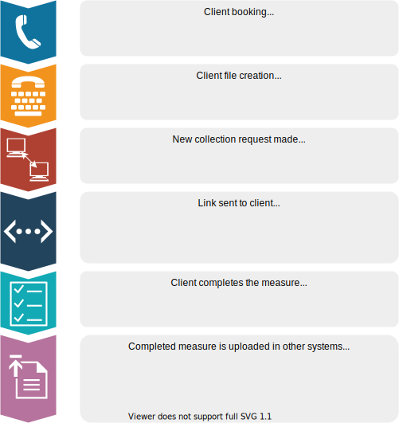
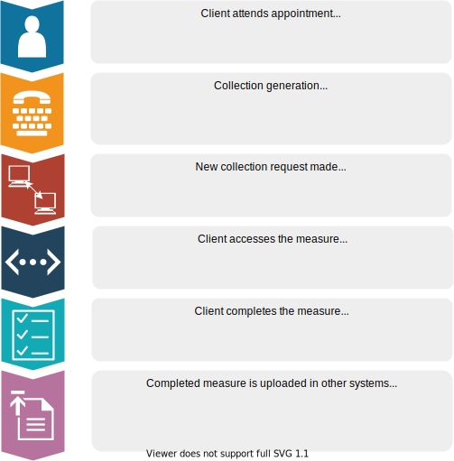

.. _overview:

Overview
========

What is the Online Measures Self Service System (OMSSS)?
---------------------------------------------------------

The OMSSS is an online service funded by the Australian Government Department
of Health (the department) as part of the Primary Mental Health Care Minimum
Data Set (PMHC MDS). It allows clients of PHN-commissioned mental health services
to complete the standardised measures mandated in the PMHC MDS and have the
results reported back to their service providers.

The OMSSS offers flexibility in the way that outcome measures are collected,
making it more accessible to service consumers who will be able to complete
the information on their devices, at a time that suits them. The system can
replace the current 'paper and pencil' systems currently in place in many
organisations. It is also adaptable to the existing processes
of each provider organisation, integrating with a range of local third-party
client information management systems (CIMS) via an Application Programming
Interface (API). More information is available at the OMSSS REST API
website: `https://api.omsss.online/ <https://api.omsss.online/>`_.

Subject to the permitted uses described below, the OMSSS can be used by PHNs
and their commissioned provider organisations to collect any of the following
outcome measures mandated in the PMHC MDS: Kessler 5 (K5),
Kessler 10 Plus (K10+), Strengths and Difficulties Questionnaire (SDQ).
Additionally, the YES PHN survey can be collected through the OMSSS.
Information about these measures can be found at:
`https://pmhc-mds.com/resources/ <https://pmhc-mds.com/resources/>`_.

How does it work?
-----------------

The OMSSS is accessed by clients of PHN-commissioned mental health services
and used to enter outcome measures, for example the Kessler-10 Plus (K10+).
The item scores are automatically totalled and made available to the PMHC MDS
or the provider’s CIMS. It should be noted that the item scores and totals
will only be uploaded into a provider’s CIMS if the CIMS have been integrated
with the OMSSS using the API. The information can also be provided in a report
to the relevant service provider. This automation reduces the administrative
workload of clinical staff and minimises the chance of errors.

The OMSSS has been designed to be flexible and work within the differing processes of
many service providers. Below are a couple of examples of how OMSSS might be integrated into
existing processes:

Example 1: Measure sent by SMS or email to client to complete before their first appointment
~~~~~~~~~~~~~~~~~~~~~~~~~~~~~~~~~~~~~~~~~~~~~~~~~~~~~~~~~~~~~~~~~~~~~~~~~~~~~~~~~~~~~~~~~~~~

In this example, the process of creating a new ‘collection’ using the measure selected as
most appropriate for the client is started by the user of the registration system
when taking the appointment (for example, a receptionist). Clients should be advised
when their appointment is created, that a link will be sent to them via email or
SMS inviting them to complete a measure. Reception or other staff should
be prepared to provide some key information about the reason for the invitation and the
importance of completing the online measure. :ref:`guidance-for-clients` provides
guidance on suitable wording that can be used and possibly incorporated in existing
information documents developed locally to advise clients on the services they
can expect to receive.

1. The client books an appointment with the user of the registration system,
   for example, by phone.
2. The user of the registration system enters the CIMS at the time of booking,
   and creates a new file for the client, which generates a ‘collection’ in OMSSS.
3. The client is advised that a link will be sent to them via email or SMS to complete
   a measure.
4. A request for a new ‘collection’ is sent to the client via email or SMS. The
   invitation to the client will identify their health practitioner (or the
   health practitioner's organisation) as the source.
5. The request sent to the client contains a link or QR code to complete the measure.
6. The client will then complete the measure using their own device at home or
   in the waiting room prior to the appointment.
7. Once completed, the questionnaire will be automatically uploaded into the CIMS.
   Service providers may elect to be notified once their client has completed a
   measure.

It is important to note that privacy protection and consent requirements applying to
all data collected apply to measures collected through OMSSS. In many
instances, it will not be possible to have discussed the consent process with clients
prior to their first appointment. In these instances, the consent flag on the client's
record in the PMHC MDS should be recorded as 'No' and changed to 'Yes' after consent
has been obtained.

Figure 1.1 summarises how the OMSSS might be integrated into a
client management system when a SMS or email invitation is sent to the client.

   How does OMSSS work - Example 1 - Measure sent by SMS or email to client to complete before their first appointment

Example 2: Measure completed by client at health practitioner’s service delivery centre
~~~~~~~~~~~~~~~~~~~~~~~~~~~~~~~~~~~~~~~~~~~~~~~~~~~~~~~~~~~~~~~~~~~~~~~~~~~~~~~~~~~~~~~

In this example, the process of creating a new ‘collection’ using the
measure selected as most appropriate for the client is started by the user of the
registration system (either a receptionist or a practitioner) when the client
attends the service. As per Example 1, it is essential that clients be advised
about the reason for the invitation to complete the questionnaire, using the
guidance wording suggested at :ref:`guidance-for-clients`.

1. The client attends the health practitioner’s service delivery centre for an appointment.
   This might be the client's first or a subsequent appointment.
2. When the user of the registration system sends a request for a new
   ‘collection’, a QR code is generated.
3. A mobile device such as a tablet can then be used to navigate to the link
   provided by the QR code.
4. The client can be given the tablet to fill out the measure in the waiting
   room or during their appointment.
5. The completed measure will then be uploaded automatically into the
   CIMS. Service providers may elect to be notified once their client has completed
   a measure.

   How does OMSSS work - Example 2 - Measure completed by client at health practitioner's service delivery centre

Features and benefits
---------------------

Regular monitoring by service providers of client outcomes using standardised
measures is critical to informing treatment decisions and ongoing dialogue
between service providers and their clients.

Reporting on client outcomes is a fundamental requirement of the PMHC MDS,
and the OMSSS has been developed to support regular collection with the
following features and benefits:

* Enables clients to complete measures in their own time and on their own
  device which may improve completion rates
* Provide greater insight into clients’ progress and the efficacy of treatments
* Flexibility for the OMSSS to be implemented in a way that suits the
  provider’s ways of working and preferred approach to client completion of
  measures
* Flexibility regarding the treatment of completed questionnaires.
  Subscales can be uploaded to the PMHC MDS, the provider’s own CIMS
  (if integrated with the OMSSS using the API), and reports can be emailed
  directly to the relevant practitioner
* Significant reduction in data entry for staff, and
* Automated scoring and integration with the PMHC MDS / CIMS reduce the risk
  of data entry and scoring errors.
